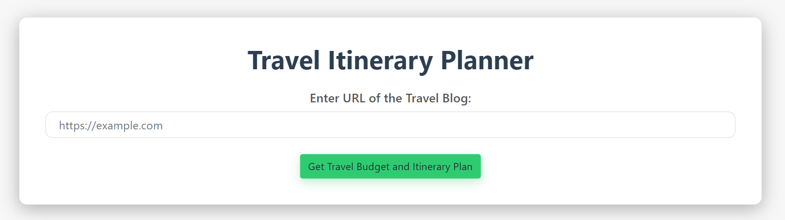
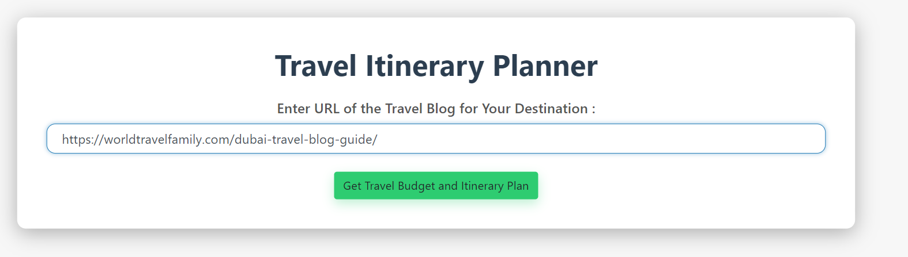
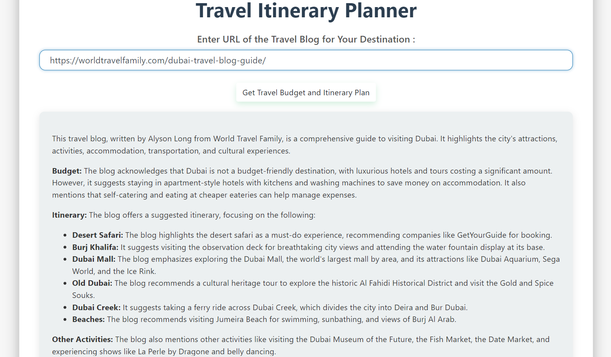

# Travel Itinerary Planner

This project is a web-based tool designed to help users plan their travel itineraries by scraping information from travel blog web pages. The website utilizes the Firecrawl SDK to extract relevant content from the provided URL and employs the Gemini API to generate a travel budget and itinerary plan based on the blog content. This tool assists users in quickly organizing their travel plans with insights from various travel blogs.

## Features

- **Scrape Travel Blog Data**: Utilizes the Firecrawl SDK to extract relevant content from travel blog URLs provided by the user.
- **Itinerary and Budget Planning**: Uses the Gemini API to analyze the scraped content, generating a detailed travel itinerary and estimated budget for the trip.
- **User-Friendly Interface**: Provides a simple and intuitive interface for users to input travel blog URLs and view the generated travel plans.
- **Responsive Design**: The website design is fully responsive, ensuring a seamless experience on both desktop and mobile devices.

## Technologies Used

- **Firecrawl SDK**: For scraping travel-related content from specified URLs.
- **Gemini API**: For analyzing the scraped content and generating travel itineraries and budget estimates.
- **Python**: The core programming language used for backend development and integrating Firecrawl and Gemini.
- **Flask**: A lightweight WSGI web application framework used to build the backend and serve the web pages.
- **HTML/CSS**: For frontend development, providing a modern and responsive user interface.

## How the Website Looks

Below are screenshots showing different parts of the website:

*Home page with input form for travel blog URL.*

*Page showing the results after scraping and processing the travel blog.*

*Generated travel itinerary and budget.*

s
